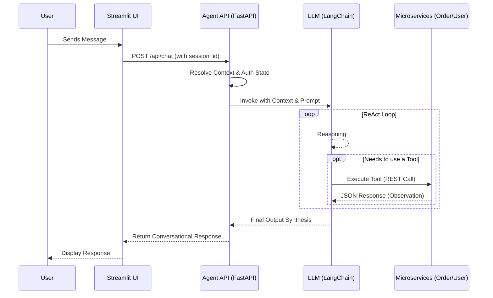

# Architecture Overview

This project implements a distributed microservices system for the Zomato AI Customer Care ecosystem. It utilizes **FastAPI** for backend microservices, **LangChain** for autonomous agent orchestration, **Streamlit** for the frontend interface, and **SQLite** for data persistence.

## System Components

### 1. The Frontend (Streamlit)
Located in `frontend/`, this service provides an interactive chat interface mimicking a customer support portal.
- **Session Identification**: Automatically generates a unique `session_id` to persist conversation history context across HTTP calls.
- **Communication**: Interacts exclusively with the Agent Microservice via REST (`POST /api/chat`).

### 2. The Agent Orchestrator (FastAPI + LangChain)
Located in `agent/`, this is the "brain" of the ecosystem. (Runs on port `8000`)

#### Agent Architecture
- **ReAct Architecture (Reasoning + Acting)**: The agent operates on a ReAct loop where it evaluates user queries, determines the required tools to fulfill the intent, and iteratively refines its responses based on tool feedback.
- **Memory & Context Management**: The agent maintains conversation history tied to a `session_id`. An in-memory store in `session_manager.py` tracks active sessions and maps them to authenticated user identities. Idle sessions are purged after 5 minutes of inactivity to conserve resources.
- **Dynamic System Prompts**: The core logic generates a dynamic `system_prompt` injected into the LLM context. This prompt is conditional on the user's authentication state, explicitly forbidding the LLM from executing secure operations (like order cancellation or refund processing) unless the user has successfully passed OTP verification.
- **Autonomous Tooling Framework**: The agent exposes capabilities via LangChain's `@tool` decorator. These tools are essentially wrappers around synchronous HTTP calls that securely invoke endpoints on downstream microservices. They include typed parameter definitions (via Pydantic schemas under the hood) enabling the LLM to structure its arguments appropriately.

### 3. Order Management Microservice (FastAPI)
Located in `mock_services/zomato_order_service/`, this API isolates all order-related domain logic. (Runs on port `8001`)

#### Service Details
- **Order Lifecycle Endpoints**: Exposes REST endpoints to fetch active order details, track driver ETA, fetch specific order items, process address modifications, and cancel ongoing orders.
- **Driver Communication**: Provides a mock SMS endpoint that simulates dispatching messages to delivery partners (e.g. "Leave order at the door").
- **Complaint Handling & Compensation**: Implements intelligent evaluation of user complaints (e.g. missing items, cold food). If the complaint is valid based on business rules, this microservice autonomously communicates with the User Management Service to trigger financial refunds directly into the user's Zomato Wallet.

### 4. User Management Microservice (FastAPI)
Located in `mock_services/zomato_user_management_service/`, this API centralizes customer identities, authentication, and finances. (Runs on port `8002`)

#### Service Details
- **Authentication (OTP Flow)**: Manages mock OTP generation, dispatch (logging to console), and validation. The agent microservice relies entirely on this service to establish secure trust.
- **Wallet & Finance Operations**: Controls the user's Zomato Wallet ledger. Provides endpoints to fetch current balance and securely processes credit requests (e.g. automated compensation refunds invoked by the Order Service).
- **Subscription Management**: Manages user subscription tiers (e.g. Zomato Gold). Generates mock payment links when users request renewals, providing a seamless transactional flow.

### 5. Shared Mock Database (SQLite)
Located in `mock_services/data/zomato_mock.db`, this database acts as the single source of truth for the mock environment.
- **Relational Tables**: It maintains distinct schemas for `customers`, `orders`, `order_items`, `payments`, and `complaints`.
- **Automated Seeding**: The initialization script `database.py` heavily seeds this database with dynamic, interconnected mock data upon container launch to ensure a rich testing environment.

## Agent Execution Flow

1. **User Request**: The user submits a message via the Streamlit UI, which is forwarded to `/api/chat`.
2. **Context Resolution**: The `agent/main.py` checks if the `session_id` is currently authenticated. It retrieves the conversation history from memory and injects it into the LangChain Executor context.
3. **Reasoning & Tool Selection**: The LLM analyzes the request and decides if it needs to act autonomously using a tool (e.g., calling `track_driver(order_id="ORD123")`).
4. **Tool Execution**: If a tool is invoked, it makes a REST call over the internal Docker network to the appropriate microservice (Order or User API). The JSON response is parsed and fed back to the LLM as observation context.
5. **Final Output Synthesis**: The LLM processes the tool output, determines if further action is needed, or synthesizes a final conversational response and returns it to the Streamlit UI.
